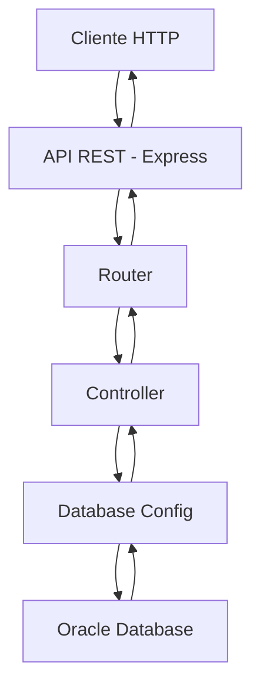

# 🚗 SISTEMA DE EVALUACIÓN DE MANEJO: ¡Backend Profesional! 🚀

---

## ✨ ¿Qué es el Sistema de Evaluación de Manejo?

<div align="center">
  
  > **"Sistema backend completo con API REST para gestión integral de centros de evaluación de manejo, exámenes teóricos y prácticos, implementado con Oracle Database y Node.js"**
  
  🎯 **¡Backend profesional con 78 endpoints, consultas SQL avanzadas y documentación completa!** 🎯
  
</div>

<div align="center">

### 🚀 Características Principales

| Característica | Descripción |
|:---:|:---:|
| 🗄️ **Oracle Database 21c** | Base de datos empresarial dockerizada |
| ⚡ **78 Endpoints REST** | API completa con CRUD y consultas |
| 🔐 **15 Tablas Relacionales** | Modelo normalizado y escalable |
| 🐳 **Docker Compose** | Despliegue automático en contenedores |
| 📊 **4 Consultas SQL** | Análisis estadístico avanzado |
| 🎨 **Postman Collection** | Documentación interactiva completa |
| 📚 **Documentación Completa** | 5 guías técnicas detalladas |
| 🧪 **Testing Automatizado** | Scripts de prueba y verificación |

</div>

---

## 👨‍💻 Desarrollador

<div align="center">

**🚀 HÉCTOR DANIEL ORTIZ OSORIO**  
*Estudiante de Ingeniería en Ciencias y Sistemas*  
📧 Carnet: **202203806**  
[](https://github.com/DaaNiieeL123/)

</div>

---

## 🛠️ Stack Tecnológico

<div align="center">

### 🏗️ **Arquitectura del Sistema**

| Componente | Descripción | Características |
|:---:|:---:|:---:|
| 📊 **Catálogos** | Géneros, Tipos Licencia, Tipos Trámite, Departamentos, Municipios | 5 tablas |
| 🏢 **Entidades Principales** | Centros, Escuelas, Preguntas Teóricas, Preguntas Prácticas | 4 tablas |
| 📝 **Módulo Transaccional** | Correlativos, Registros, Exámenes, Respuestas | 5 tablas |
| 🔗 **Relaciones** | Ubicaciones Escuela-Centro | 1 tabla |
| **TOTAL** | **Sistema completo normalizado** | **15 tablas** |

### 💻 **Tecnologías Implementadas**

<table align="center">
<tr>
<td align="center" width="33%">

### **Oracle Database 21c** 🗄️

**¿Por qué Oracle?**
- 🏢 Base de datos empresarial robusta
- 🔒 Seguridad y consistencia ACID
- ⚡ Alto rendimiento transaccional
- 🌍 Estándar de la industria

</td>
<td align="center" width="33%">

### **Node.js + Express** 🚀

**Backend Profesional:**
- ⚡ API REST escalable y rápida
- 🔧 Arquitectura modular MVC
- 📦 Ecosistema npm robusto
- 🔄 Manejo asíncrono eficiente

</td>
<td align="center" width="33%">

### **Docker Compose** 🐳

**Infraestructura como Código:**
- 📦 Contenedores aislados
- 🔄 Despliegue reproducible
- 🛠️ Orquestación automática
- ☁️ Portabilidad total

</td>
</tr>
</table>

</div>

---

## 🗃️ Modelo de Datos: Sistema Completo

<div align="center">

### 🏗️ **Arquitectura de Base de Datos**

| Categoría | Tablas | Propósito |
|:---:|:---:|:---:|
| **📋 Catálogos** | genero_catalogo, tipo_licencia, tipo_tramite | Datos maestros del sistema |
| **🌎 Geografía** | departamento, municipio | División territorial de Guatemala |
| **🏢 Infraestructura** | centro, escuela, ubicacion | Red de centros y escuelas |
| **❓ Banco de Preguntas** | pregunta, pregunta_practico | Repositorio de evaluaciones |
| **📝 Gestión de Exámenes** | correlativo, registro, examen | Proceso de evaluación |
| **✅ Respuestas** | respuesta_usuario, respuesta_practico_usuario | Resultados y calificaciones |

### 🔄 **Relaciones Clave del Sistema**

```
escuela ←→ centro (ubicacion)     [Muchos a Muchos]
municipio → departamento           [Uno a Muchos]
examen → registro                  [Uno a Uno]
respuesta_usuario → pregunta       [Muchos a Uno]
respuesta_usuario → examen         [Muchos a Uno]
```

### 📈 **Capacidades del Sistema**

<div align="center">

| Métrica | Valor | Descripción |
|:---:|:---:|:---:|
| **Tablas en BD** | 15 | Modelo completamente normalizado |
| **Endpoints CRUD** | 73 | 5 operaciones × 15 recursos (algunas sin DELETE) |
| **Consultas SQL** | 4 | 3 obligatorias + 1 personalizable |
| **Health Check** | 1 | Verificación del sistema |
| **🎯 TOTAL ENDPOINTS** | **78** | API REST completa |
| **Controladores** | 16 | Lógica de negocio modular |
| **Rutas** | 16 | Routing organizado |
| **Documentación** | 6 guías | Manuales técnicos completos |

</div>

</div>

---

## 🚀 Instalación y Configuración

### 📋 **Requisitos Previos**

<div align="center">

| Componente | Versión | Propósito |
|:---:|:---:|:---:|
| **Sistema Operativo** | Linux/Windows/macOS | Entorno de desarrollo |
| **Docker Desktop** | 20.10+ | Contenedores y orquestación |
| **Docker Compose** | 1.29+ | Gestión de servicios múltiples |
| **Git** | 2.0+ | Control de versiones |
| **RAM Disponible** | 8GB mínimo | Requisito para Oracle |
| **Espacio en Disco** | 5GB | Imágenes Docker y datos |

</div>

### 📥 **Clonar el Repositorio**

```bash
# Clonar desde GitHub
git clone https://github.com/DaaNiieeL123/BD1B_2S2025_202203806.git
cd BD1B_2S2025_202203806

# O descargar y extraer
wget https://github.com/DaaNiieeL123/BD1B_2S2025_202203806/archive/main.zip
unzip main.zip && cd BD1B_2S2025_202203806-main
```

### 🔨 **Levantar el Sistema**

```bash
# Opción 1: Usar script automatizado (RECOMENDADO)
./scripts/start.sh

# Opción 2: Docker Compose directo
docker-compose up -d

# El sistema se levantará automáticamente con:
# - Oracle Database en puerto 1521
# - API REST en puerto 3000
# - Creación automática de 15 tablas
# - 11 secuencias para IDs auto-incrementales
```

### ⚡ **Verificación del Sistema**

```bash
# 1. Verificar contenedores
docker-compose ps
# Debe mostrar: oracle-evaluacion-manejo y api-evaluacion-manejo (Up)

# 2. Health check de la API
curl http://localhost:3000/health
# Respuesta esperada: {"status":"OK","message":"API funcionando..."}

# 3. Probar un endpoint
curl http://localhost:3000/api/centros | jq .
```

### 📊 **Cargar Datos de Prueba**

```bash
# Datos de ejemplo para testing
docker exec -i oracle-evaluacion-manejo sqlplus system/OraclePassword123@XE < database/datos_prueba.sql

# Esto cargará:
# - 3 Centros de Evaluación
# - 3 Escuelas de Manejo
# - 3 Departamentos (Guatemala, Quetzaltenango, Alta Verapaz)
# - 4 Municipios
# - 25 Preguntas Teóricas
# - 10 Preguntas Prácticas
# - Datos de catálogos (géneros, tipos de licencia, tipos de trámite)
```

---

## 🎮 Uso del Sistema

### 🎯 **API REST: 78 Endpoints Disponibles**

#### **🏥 Health Check del Sistema**
```bash
# Verificar estado de la API y base de datos
curl http://localhost:3000/health

# Respuesta esperada:
{
  "status": "OK",
  "message": "API de Evaluación de Manejo funcionando correctamente",
  "database": "Conectado",
  "timestamp": "2025-10-16T..."
}
```

#### **📝 Operaciones CRUD (73 Endpoints)**

<div align="center">

| Operación | Método | Ruta | Descripción |
|:---:|:---:|:---:|:---:|
| **Listar Todos** | GET | `/api/{recurso}` | Obtiene todos los registros |
| **Obtener por ID** | GET | `/api/{recurso}/:id` | Obtiene un registro específico |
| **Crear Nuevo** | POST | `/api/{recurso}` | Crea un nuevo registro |
| **Actualizar** | PUT | `/api/{recurso}/:id` | Modifica un registro existente |
| **Eliminar** | DELETE | `/api/{recurso}/:id` | Elimina un registro |

</div>

**🔖 Recursos Disponibles (15):**
- `centros`, `escuelas`, `departamentos`, `municipios`
- `preguntas`, `preguntas-practicas`
- `generos`, `tipos-licencia`, `tipos-tramite`
- `correlativos`, `registros`, `examenes`
- `respuestas-usuario`, `respuestas-practicas`, `ubicaciones`

#### **📊 Consultas SQL Avanzadas (4 Endpoints)**

```bash
# 1. Estadísticas por Centro
GET /api/consultas/estadisticas-centros
# Retorna: Promedios teóricos/prácticos, cantidad aprobados por centro

# 2. Ranking de Evaluadores
GET /api/consultas/ranking-evaluadores
# Retorna: Lista ordenada por resultado, punteo total y fecha

# 3. Pregunta Más Difícil
GET /api/consultas/pregunta-dificil
# Retorna: Pregunta con menor % de aciertos y estadísticas

# 4. Consulta Personalizada
POST /api/consultas/general
Content-Type: application/json
{
  "sql": "SELECT * FROM centro WHERE ROWNUM <= 5"
}
```

#### **💡 Ejemplo de Uso: Crear un Centro**

```bash
# Request
curl -X POST http://localhost:3000/api/centros \
  -H "Content-Type: application/json" \
  -d '{
    "nombre_centro": "Centro de Evaluación Guatemala Sur"
  }'

# Response
{
  "success": true,
  "message": "Centro creado exitosamente",
  "data": {
    "id_centro": 4,
    "nombre_centro": "Centro de Evaluación Guatemala Sur"
  }
}
```

📖 **[Ver documentación completa de todos los endpoints →](./docs/GUIA_ENDPOINTS.md)**

---

## 📚 Documentación Técnica Completa

<div align="center">

| 📖 Guía | 📝 Descripción | 🔗 Enlace |
|:---:|:---:|:---:|
| **Carga de Datos** | Guía para cargar datos via API con Postman (IDs manuales + arrays) | [GUIA_CARGA_DATOS.md](./docs/GUIA_CARGA_DATOS.md) |
| **API Endpoints** | Referencia completa de los 78 endpoints con ejemplos | [GUIA_ENDPOINTS.md](./docs/GUIA_ENDPOINTS.md) |
| **Testing & QA** | Pruebas con Postman, cURL y scripts de verificación | [GUIA_TESTING.md](./docs/GUIA_TESTING.md) |
| **DBeaver Setup** | Conexión y administración de la base de datos | [GUIA_DBEAVER.md](./docs/GUIA_DBEAVER.md) |
| **Arquitectura** | Diseño del sistema, flujos y patrones | [ARQUITECTURA.md](./docs/ARQUITECTURA.md) |
| **Troubleshooting** | Solución de problemas comunes | [TROUBLESHOOTING.md](./docs/TROUBLESHOOTING.md) |

</div>

---

## 🗂️ Estructura del Proyecto

### 📁 **Organización de Archivos**

```
BD1B_2S2025_proyecto/
├── 📄 docker-compose.yml           # Orquestación de servicios
├── 📄 README.md                    # Documentación principal (este archivo)
│
├── 🚀 api/                         # API REST (Node.js + Express)
│   ├── 📄 server.js                # Punto de entrada del servidor
│   ├── 📄 package.json             # Dependencias y scripts npm
│   ├── 📄 Dockerfile               # Imagen Docker del API
│   │
│   ├── 🎮 controllers/             # Lógica de negocio (16 controladores)
│   │   ├── centro.controller.js
│   │   ├── escuela.controller.js
│   │   ├── pregunta.controller.js
│   │   ├── examen.controller.js
│   │   ├── consultas.controller.js # Consultas SQL avanzadas
│   │   └── ... (11 más)
│   │
│   ├── 🛣️ routes/                  # Definición de endpoints (16 rutas)
│   │   ├── centro.routes.js
│   │   ├── escuela.routes.js
│   │   ├── consultas.routes.js
│   │   └── ... (13 más)
│   │
│   └── ⚙️ config/                  # Configuración
│       └── database.js             # Pool de conexiones Oracle
│
├── 🗄️ database/                    # Scripts SQL
│   ├── init.sql                    # DDL: 15 tablas + 11 secuencias
│   ├── datos_prueba.sql            # Datos de ejemplo para testing
│   └── limpiar_datos.sql           # Script para limpiar datos
│
├── 📚 docs/                        # Documentación técnica (6 guías)
│   ├── GUIA_CARGA_DATOS.md         # Carga de datos vía API
│   ├── GUIA_ENDPOINTS.md           # Referencia de 78 endpoints
│   ├── GUIA_TESTING.md             # Manual de pruebas
│   ├── GUIA_DBEAVER.md             # Configuración de DBeaver
│   ├── ARQUITECTURA.md             # Diseño del sistema
│   └── TROUBLESHOOTING.md          # Solución de problemas
│
├── 📬 postman/                     # Testing con Postman
│   └── Evaluacion_Manejo.postman_collection.json  # 78 endpoints
│
└── 🔧 scripts/                     # Utilidades del sistema
    ├── start.sh                    # Iniciar servicios (con auto-setup)
    └── stop.sh                     # Detener servicios
```

### 🎯 **Flujo de Ejecución**



---

## 🧪 Testing y Verificación

### 🔍 **Verificación Rápida del Sistema**

```bash
# 1. Health Check - Verificar que todo esté funcionando
curl http://localhost:3000/health

# Respuesta esperada:
# {"status":"OK","message":"API funcionando...","database":"Conectado"}

# 2. Listar Centros de Evaluación
curl http://localhost:3000/api/centros | jq .

# 3. Ejecutar Consulta SQL de Estadísticas
curl http://localhost:3000/api/consultas/estadisticas-centros | jq .
```

### 📬 **Testing con Postman**

<div align="center">

#### **🎯 Colección Postman Completa**

| Característica | Detalle |
|:---:|:---:|
| **Total de Endpoints** | 78 requests organizados |
| **Carpetas** | 16 colecciones por recurso |
| **Variables** | Configuración de `base_url` |
| **Ejemplos** | Request/Response de cada endpoint |

</div>

**📥 Pasos para Importar:**

1. Abrir **Postman Desktop**
2. Click en **Import** (esquina superior izquierda)
3. Seleccionar archivo: `postman/Evaluacion_Manejo.postman_collection.json`
4. Configurar variable `base_url`: `http://localhost:3000`
5. ✅ ¡Listo! Prueba cualquiera de los 78 endpoints

**📊 Estructura de la Colección:**

```
📁 Evaluación de Manejo API
├── 🏥 Health Check (1)
├── 📁 Centros (5 endpoints)
├── 📁 Escuelas (5 endpoints)
├── 📁 Departamentos (5 endpoints)
├── 📁 Municipios (5 endpoints)
├── 📁 Preguntas Teóricas (5 endpoints)
├── 📁 Preguntas Prácticas (5 endpoints)
├── 📁 Géneros (5 endpoints)
├── 📁 Tipos Licencia (5 endpoints)
├── 📁 Tipos Trámite (5 endpoints)
├── 📁 Correlativos (5 endpoints)
├── 📁 Registros (5 endpoints)
├── 📁 Exámenes (5 endpoints)
├── 📁 Respuestas Usuario (5 endpoints)
├── 📁 Respuestas Prácticas (5 endpoints)
├── 📁 Ubicaciones (5 endpoints)
└── 📁 Consultas SQL (4 endpoints)
```

🧪 **[Ver guía completa de testing →](./docs/GUIA_TESTING.md)**

---

## 🗄️ Administración de Base de Datos

### **🔌 Configuración DBeaver**

<div align="center">

| Campo | Valor | Descripción |
|:---:|:---:|:---:|
| **Host** | `localhost` | Servidor local |
| **Puerto** | `1521` | Puerto estándar Oracle |
| **Database** | `XE` | Oracle Express Edition |
| **Service Name** | `XE` | Nombre del servicio |
| **Usuario** | `system` | Usuario administrador |
| **Contraseña** | `OraclePassword123` | Credencial del sistema |

</div>

### **📊 Consultas Útiles en DBeaver**

```sql
-- Ver todas las tablas creadas
SELECT table_name FROM user_tables ORDER BY table_name;

-- Contar registros en todas las tablas
SELECT 'CENTRO' AS tabla, COUNT(*) AS registros FROM centro
UNION ALL
SELECT 'ESCUELA', COUNT(*) FROM escuela
UNION ALL
SELECT 'PREGUNTA', COUNT(*) FROM pregunta
ORDER BY tabla;

-- Ver estructura de una tabla
SELECT column_name, data_type, data_length, nullable
FROM user_tab_columns
WHERE table_name = 'CENTRO'
ORDER BY column_id;
```

🗄️ **[Ver guía completa de DBeaver →](./docs/GUIA_DBEAVER.md)**

---

## 🛠️ Comandos Útiles del Sistema

### ⚡ **Gestión de Servicios**

```bash
# 🚀 Iniciar todo el sistema
./scripts/start.sh
# - Verifica Docker
# - Levanta Oracle DB + API
# - Crea tablas automáticamente si no existen
# - Tiempo estimado: 2-3 minutos

# 🛑 Detener servicios
./scripts/stop.sh
# - Detiene contenedores sin borrar datos

# 🔄 Reiniciar servicios
docker-compose restart

# 📊 Ver estado de contenedores
docker-compose ps

# 📝 Ver logs en tiempo real
docker-compose logs -f

# 📝 Ver logs de un servicio específico
docker-compose logs -f api        # Solo API
docker-compose logs -f oracle-db  # Solo Oracle
```

### 🗄️ **Gestión de Base de Datos**

```bash
# 🔌 Conectar a Oracle con SQLPlus
docker exec -it oracle-evaluacion-manejo sqlplus system/OraclePassword123@XE

# 📊 Cargar datos de prueba
docker exec -i oracle-evaluacion-manejo sqlplus system/OraclePassword123@XE < database/datos_prueba.sql

# 🧹 Limpiar datos (mantiene estructura)
docker exec -i oracle-evaluacion-manejo sqlplus system/OraclePassword123@XE < database/limpiar_datos.sql

# 🔄 Recrear tablas desde cero
docker exec -i oracle-evaluacion-manejo sqlplus system/OraclePassword123@XE < database/init.sql
```

### ⚠️ **Comandos de Emergencia**

```bash
# 💥 Reseteo completo (BORRA TODO: contenedores + volúmenes + datos)
docker-compose down -v

# 🧹 Limpiar sistema Docker completo
docker system prune -a

# 🔄 Volver a empezar desde cero
docker-compose down -v && docker-compose up -d
```
---
## 🆘 Soporte y Troubleshooting

### 🔧 **Problemas Comunes**

<div align="center">

| Error | Causa | Solución |
|:---:|:---:|:---:|
| `Cannot connect to database` | Oracle no está listo | Esperar 1-2 min más |
| `Port 3000 already in use` | Otra app usa el puerto | Cambiar puerto en .env |
| `ORA-00942: table does not exist` | Tablas no creadas | Ejecutar init.sql |
| `docker-compose: command not found` | Docker Compose no instalado | Instalar Docker Desktop |

</div>

🔧 **[Ver guía completa de troubleshooting →](./docs/TROUBLESHOOTING.md)**

---

## 📚 Recursos Adicionales

-  **[Guía de Carga de Datos](./docs/GUIA_CARGA_DATOS.md)** - Cargar datos via API con IDs manuales
- �📖 **[Documentación Completa de la API](./docs/GUIA_ENDPOINTS.md)** - Todos los endpoints con ejemplos
- 🧪 **[Guía de Testing](./docs/GUIA_TESTING.md)** - Cómo probar el sistema
- 🏗️ **[Arquitectura del Sistema](./docs/ARQUITECTURA.md)** - Diseño y patrones
- 🔧 **[Solución de Problemas](./docs/TROUBLESHOOTING.md)** - Errores comunes

---

## 👥 Información del Proyecto

<div align="center">

**🎓 Universidad de San Carlos de Guatemala**  
**Facultad de Ingeniería - Ciencias y Sistemas**

---

**👨‍💻 Desarrollador**  
**Héctor Daniel Ortiz Osorio**  
📧 Carnet: **202203806**

---

**📚 Curso**  
**Bases de Datos 1 - Sección B**  
**Fase 2 - Backend para Centros de Evaluación de Manejo**

---

**🔗 Repositorio**  
[](https://github.com/DaaNiieeL123/BD1B_2S2025_202203806)

[https://github.com/DaaNiieeL123/BD1B_2S2025_202203806](https://github.com/DaaNiieeL123/BD1B_2S2025_202203806)

</div>

---

## 📄 Licencia

Proyecto académico - Universidad de San Carlos de Guatemala © 2025

---

<div align="center">

### 🚗 **¡Sistema de Evaluación de Manejo - Backend Completo!** 🚀

**Desarrollado con 💙 para el aprendizaje de bases de datos y desarrollo backend**

[](https://github.com/DaaNiieeL123/BD1B_2S2025_202203806)
[](https://github.com/DaaNiieeL123/BD1B_2S2025_202203806/issues)

---

### ⭐ **¡Gracias por revisar este proyecto!** ⭐

*Implementación profesional de API REST con Oracle Database*

</div>

