<div align="center">

# 📦 GUÍA DE CARGA DE DATOS VÍA API

### ¡Orden correcto para insertar datos respetando Foreign Keys! 🎯

</div>

## 📋 ¿Qué encontrarás aquí?

> *"El orden correcto para cargar datos evitando errores de integridad referencial"*

Este documento te guía paso a paso para insertar datos en el sistema mediante las APIs REST, respetando las **Foreign Keys** y evitando errores de `constraint violated`.

---

## ⚠️ IMPORTANTE: Orden Obligatorio

Las tablas tienen **relaciones de dependencia** (Foreign Keys). Debes insertar los datos en el orden correcto o recibirás errores como:

```sql
ORA-02291: integrity constraint violated - parent key not found
```

---

## 🎯 Arquitectura de Dependencias

<div align="center">

|    Nivel    | Tablas                                                   | Dependencias                                    |
| :---------: | -------------------------------------------------------- | ----------------------------------------------- |
| **1** | `GENERO_CATALOGO`, `TIPO_LICENCIA`, `TIPO_TRAMITE` | ✅ Ninguna                                      |
| **2** | `DEPARTAMENTO`                                         | ✅ Ninguna                                      |
| **2** | `MUNICIPIO`                                            | ⚠️ Requiere:`DEPARTAMENTO`                  |
| **3** | `ESCUELA`, `CENTRO`                                  | ✅ Ninguna                                      |
| **3** | `UBICACION`                                            | ⚠️ Requiere:`MUNICIPIO`                     |
| **4** | `PREGUNTA`                                             | ⚠️ Requiere:`TIPO_LICENCIA`                 |
| **4** | `PREGUNTA_PRACTICO`, `CORRELATIVO`                   | ✅ Ninguna                                      |
| **5** | `REGISTRO`                                             | ⚠️ Requiere: múltiples tablas anteriores     |
| **5** | `EXAMEN`                                               | ⚠️ Requiere:`REGISTRO`, `UBICACION`       |
| **5** | `RESPUESTA_USUARIO`                                    | ⚠️ Requiere:`EXAMEN`, `PREGUNTA`          |
| **5** | `RESPUESTA_PRACTICO_USUARIO`                           | ⚠️ Requiere:`EXAMEN`, `PREGUNTA_PRACTICO` |

</div>

---

## 🚀 Herramientas Disponibles

| Herramienta           | Descripción                                                | Recomendado |
| --------------------- | ----------------------------------------------------------- | :---------: |
| **Postman**     | ✅**MÉTODO PRINCIPAL** - Colección con 78 endpoints | ⭐⭐⭐⭐⭐ |
| **cURL**        | Alternativa: Comandos en terminal                           |   ⭐⭐⭐   |
| **REST Client** | Alternativa: Extensión VSCode                              |    ⭐⭐    |

### 📮 PASO 1: Importar Colección Postman

> **💡 RECOMENDADO:** Usa Postman para cargar los datos con JSON directamente

```bash
📁 Archivo de colección:
postman/Evaluacion_Manejo.postman_collection.json
```

**Pasos para importar:**

1. ✅ Abrir **Postman Desktop** o **Postman Web**
2. ✅ Click en **"Import"** (esquina superior izquierda)
3. ✅ Seleccionar el archivo `Evaluacion_Manejo.postman_collection.json`
4. ✅ Click en **"Import"**
5. ✅ **¡Listo!** Verás la colección con **78 endpoints** organizados

**Variables configuradas:**

- `base_url`: `http://localhost:3000` (ya configurado)

---

### 📋 PASO 2: Estructura de la Colección

La colección tiene **15 carpetas** (una por tabla) con **CRUD completo**:

```
📦 Sistema Evaluación de Manejo
├── 🏥 Health Check (1 endpoint)
├── 📁 Géneros (5 endpoints: GET, POST, PUT, DELETE)
├── 📁 Tipos de Licencia (5 endpoints)
├── 📁 Tipos de Trámite (5 endpoints)
├── 📁 Departamentos (5 endpoints)
├── 📁 Municipios (5 endpoints)
├── 📁 Escuelas (5 endpoints)
├── 📁 Centros (5 endpoints)
├── 📁 Ubicaciones (3 endpoints)
├── 📁 Preguntas Teóricas (5 endpoints)
├── 📁 Preguntas Prácticas (5 endpoints)
├── 📁 Correlativos (5 endpoints)
├── 📁 Registros (5 endpoints)
├── 📁 Exámenes (5 endpoints)
├── 📁 Respuestas Usuario (5 endpoints)
├── 📁 Respuestas Práctico (5 endpoints)
└── 📊 Consultas SQL (4 endpoints especiales)
```

---

## 📝 NIVEL 1: Catálogos Básicos (Sin Dependencias)

> **🎯 Objetivo:** Crear los catálogos base que no dependen de ninguna otra tabla

### 1️⃣ GENERO_CATALOGO

**📮 En Postman:**

1. Abrir carpeta: **`Géneros`** → **`Crear Género`**
2. En el **Body** (JSON), puedes enviar **uno o múltiples**:

**Opción 1: Insertar uno solo**

```json
{
  "genero": "M",
  "descripcion_genero": "Masculino"
}
```

**Opción 2: Insertar múltiples a la vez** ⚡

```json
[
  {"genero": "M", "descripcion_genero": "Masculino"},
  {"genero": "F", "descripcion_genero": "Femenino"}
]
```

3. Click en **Send**

**Campos requeridos:**

- `genero` (VARCHAR2, 1 carácter: 'M' o 'F')
- `descripcion_genero` (VARCHAR2, 255 caracteres)

<details>
<summary>🔧 Alternativa con cURL (click para expandir)</summary>

```bash
# Crear Masculino
curl -X POST http://localhost:3000/api/genero_catalogo \
  -H "Content-Type: application/json" \
  -d '{"GENERO": "M", "NOMBRE_GENERO": "Masculino"}'

# Crear Femenino
curl -X POST http://localhost:3000/api/genero_catalogo \
  -H "Content-Type: application/json" \
  -d '{"GENERO": "F", "NOMBRE_GENERO": "Femenino"}'
```

</details>

---

### 2️⃣ TIPO_LICENCIA

**📮 En Postman:**

1. Abrir carpeta: **`Tipos de Licencia`** → **`Crear Tipos de Licencia`**
2. Puedes crear **uno o múltiples**:

**Opción 1: Insertar uno solo**

```json
{
  "tipo_licencia": "A",
  "descripcion_licencia": "Motocicleta"
}
```

**Opción 2: Insertar múltiples a la vez** ⚡

```json
[
  {"tipo_licencia": "A", "descripcion_licencia": "Motocicleta"},
  {"tipo_licencia": "B", "descripcion_licencia": "Automóvil"},
  {"tipo_licencia": "C", "descripcion_licencia": "Vehículo Liviano"},
  {"tipo_licencia": "M", "descripcion_licencia": "Maquinaria Pesada"}
]
```

**Campos requeridos:**

- `tipo_licencia` (VARCHAR2, 50 caracteres)
- `descripcion_licencia` (VARCHAR2, 255 caracteres)

<details>
<summary>🔧 Alternativa con cURL (click para expandir)</summary>

```bash
# Licencia Tipo A
curl -X POST http://localhost:3000/api/tipo_licencia \
  -H "Content-Type: application/json" \
  -d '{"CATEGORIA": "A", "VEHICULO": "Motocicleta", "DESCRIPCION": "Licencia para motocicletas y bicimotos"}'

# Ver todas
curl http://localhost:3000/api/tipo_licencia | jq '.'
```

</details>

---

### 3️⃣ TIPO_TRAMITE

**📮 En Postman:**

1. Abrir carpeta: **`Tipos de Trámite`** → **`Crear Tipos de Trámite`**
2. Puedes crear **uno o múltiples**:

**Opción 1: Insertar uno solo**

```json
{
  "tipo_tramite": "PRIMERA_VEZ",
  "descripcion_tramite": "Primera vez"
}
```

**Opción 2: Insertar múltiples a la vez** ⚡

```json
[
  {"tipo_tramite": "PRIMERA_VEZ", "descripcion_tramite": "Primera vez"},
  {"tipo_tramite": "RENOVACION", "descripcion_tramite": "Renovación"},
  {"tipo_tramite": "ACTUALIZACION", "descripcion_tramite": "Actualización de datos"},
  {"tipo_tramite": "REPOSICION", "descripcion_tramite": "Reposición por pérdida"}
]
```

**Campos requeridos:**

- `tipo_tramite` (VARCHAR2, 50 caracteres)
- `descripcion_tramite` (VARCHAR2, 255 caracteres)

<details>
<summary>🔧 Alternativa con cURL (click para expandir)</summary>

```bash
# Primera Vez
curl -X POST http://localhost:3000/api/tipo_tramite \
  -H "Content-Type: application/json" \
  -d '{"NOMBRE": "Primera Vez", "PRECIO": 150.00}'

# Ver todos
curl http://localhost:3000/api/tipo_tramite | jq '.'
```

</details>

---

## 📝 NIVEL 2: Ubicaciones (Jerarquía Geográfica)

### 4️⃣ DEPARTAMENTO

**📮 En Postman:**

1. Abrir carpeta: **`Departamentos`** → **`Crear Departamento`**
2. **IMPORTANTE:** Ahora debes proporcionar el `id_departamento` manualmente

**Opción 1: Insertar uno solo**

```json
{
  "id_departamento": 1,
  "nombre_departamento": "Guatemala",
  "codigo_departamento": "01"
}
```

**Opción 2: Insertar múltiples a la vez** ⚡

```json
[
  {"id_departamento": 1, "nombre_departamento": "Guatemala", "codigo_departamento": "01"},
  {"id_departamento": 2, "nombre_departamento": "Quetzaltenango", "codigo_departamento": "09"},
  {"id_departamento": 3, "nombre_departamento": "Sacatepéquez", "codigo_departamento": "03"},
  {"id_departamento": 4, "nombre_departamento": "Alta Verapaz", "codigo_departamento": "16"}
]
```

**Campos requeridos:**

- `id_departamento` (NUMBER, manual)
- `nombre_departamento` (VARCHAR2, 100 caracteres)
- `codigo_departamento` (VARCHAR2, 10 caracteres)

---

### 5️⃣ MUNICIPIO

⚠️ **Requiere:** `id_departamento` (usa los IDs del paso anterior)

**📮 En Postman:**

1. Abrir carpeta: **`Municipios`** → **`Crear Municipio`**
2. **IMPORTANTE:** Debes proporcionar TODOS los campos manualmente

**Opción 1: Insertar uno solo**

```json
{
  "id_municipio": 1,
  "id_departamento": 1,
  "nombre_municipio": "Guatemala",
  "codigo_municipio": "01"
}
```

**Opción 2: Insertar múltiples a la vez** ⚡

```json
[
  {"id_municipio": 1, "id_departamento": 1, "nombre_municipio": "Guatemala", "codigo_municipio": "01"},
  {"id_municipio": 2, "id_departamento": 1, "nombre_municipio": "Mixco", "codigo_municipio": "08"},
  {"id_municipio": 3, "id_departamento": 1, "nombre_municipio": "Villa Nueva", "codigo_municipio": "17"},
  {"id_municipio": 4, "id_departamento": 2, "nombre_municipio": "Quetzaltenango", "codigo_municipio": "01"},
  {"id_municipio": 5, "id_departamento": 2, "nombre_municipio": "Salcajá", "codigo_municipio": "02"}
]
```

**Campos requeridos:**

- `id_municipio` (NUMBER, manual)
- `id_departamento` (NUMBER, FK)
- `nombre_municipio` (VARCHAR2, 100 caracteres)
- `codigo_municipio` (VARCHAR2, 10 caracteres)

---

## 📝 NIVEL 3: Entidades Relacionadas

### 6️⃣ ESCUELA

**📮 En Postman:**

1. Abrir carpeta: **`Escuelas`** → **`Crear Escuela`**
2. **IMPORTANTE:** Proporciona TODOS los campos manualmente

**Opción 1: Insertar una sola**

```json
{
  "id_escuela": 1,
  "nombre_escuela": "Escuela de Manejo Profesional",
  "direccion_escuela": "6ta Avenida 5-20, Zona 10",
  "numero_acuerdo": "ACUERDO-001-2024"
}
```

**Opción 2: Insertar múltiples a la vez** ⚡

```json
[
  {"id_escuela": 1, "nombre_escuela": "Escuela de Manejo Profesional", "direccion_escuela": "6ta Avenida 5-20, Zona 10", "numero_acuerdo": "ACUERDO-001-2024"},
  {"id_escuela": 2, "nombre_escuela": "Academia de Conductores Elite", "direccion_escuela": "Boulevard San Cristóbal, Zona 8", "numero_acuerdo": "ACUERDO-002-2024"},
  {"id_escuela": 3, "nombre_escuela": "Centro de Capacitación Vial", "direccion_escuela": "Calzada Roosevelt, Zona 11", "numero_acuerdo": "ACUERDO-003-2024"}
]
```

**Campos requeridos:**

- `id_escuela` (NUMBER, manual)
- `nombre_escuela` (VARCHAR2, 100 caracteres)
- `direccion_escuela` (VARCHAR2, 255 caracteres)
- `numero_acuerdo` (VARCHAR2, 50 caracteres)

---

### 7️⃣ CENTRO

**📮 En Postman:**

1. Abrir carpeta: **`Centros`** → **`Crear Centro`**
2. **IMPORTANTE:** Proporciona TODOS los campos manualmente

**Opción 1: Insertar uno solo**

```json
{
  "id_centro": 1,
  "nombre_centro": "Centro de Evaluación Central"
}
```

**Opción 2: Insertar múltiples a la vez** ⚡

```json
[
  {"id_centro": 1, "nombre_centro": "Centro de Evaluación Central"},
  {"id_centro": 2, "nombre_centro": "Centro de Evaluación Occidente"},
  {"id_centro": 3, "nombre_centro": "Centro de Evaluación Norte"}
]
```

**Campos requeridos:**

- `id_centro` (NUMBER, manual)
- `nombre_centro` (VARCHAR2, 100 caracteres)

---

### 8️⃣ UBICACION

⚠️ **Requiere:** `ID_MUNICIPIO` (obtén los IDs del NIVEL 2)

**📮 En Postman:**

1. Primero, **obtener IDs:** Carpeta **`Municipios`** → **`Listar Municipios`** (GET)
2. Anotar los `ID_MUNICIPIO` que necesites
3. Abrir carpeta: **`Ubicaciones`** → **`Crear Ubicacione`**
4. Crear ubicaciones usando los IDs obtenidos:

**Ubicación 1 - Zona 10 Guatemala (usar ID_MUNICIPIO = 1):**

```json
{
  "SEDE": "Sede Central - Zona 10",
  "DIRECCION": "Avenida La Reforma 8-60, Zona 10",
  "ID_MUNICIPIO": 1
}
```

**Ubicación 2 - Zona 9 Guatemala (usar ID_MUNICIPIO = 1):**

```json
{
  "SEDE": "Sede Zona 9",
  "DIRECCION": "6ta Avenida 13-22, Zona 9",
  "ID_MUNICIPIO": 1
}
```

**Ubicación 3 - Mixco (usar ID_MUNICIPIO = 2):**

```json
{
  "SEDE": "Sede Mixco",
  "DIRECCION": "Boulevard San Cristóbal, Zona 8",
  "ID_MUNICIPIO": 2
}
```

**Ubicación 4 - Quetzaltenango (usar ID_MUNICIPIO = 5):**

```json
{
  "SEDE": "Sede Quetzaltenango",
  "DIRECCION": "Calzada Independencia 14-50, Zona 3",
  "ID_MUNICIPIO": 5
}
```

**Campos requeridos:**

- `SEDE` (VARCHAR2, 100 caracteres)
- `DIRECCION` (VARCHAR2, 255 caracteres)
- `ID_MUNICIPIO` (NUMBER, FK)

**Campo auto-generado:**

- `ID_UBICACION` (NUMBER, secuencia)

> 💡 **Importante:** Guarda los `ID_UBICACION` generados. Los necesitarás para crear exámenes.

---

## 📝 NIVEL 4: Preguntas de Evaluación

### 9️⃣ PREGUNTA

**📮 En Postman:**

1. Abrir carpeta: **`Preguntas Teóricas`** → **`Crear Preguntas Teórica`**
2. **IMPORTANTE:** Proporciona TODOS los campos manualmente incluyendo `id_pregunta`

**Opción 1: Insertar una sola**

```json
{
  "id_pregunta": 1,
  "pregunta_texto": "¿Cuál es la velocidad máxima en zona urbana?",
  "opcion_1": "40 km/h",
  "opcion_2": "60 km/h",
  "opcion_3": "80 km/h",
  "opcion_4": "100 km/h",
  "respuesta_correcta": 2
}
```

**Opción 2: Insertar múltiples a la vez** ⚡

```json
[
  {"id_pregunta": 1, "pregunta_texto": "¿Cuál es la velocidad máxima en zona urbana?", "opcion_1": "40 km/h", "opcion_2": "60 km/h", "opcion_3": "80 km/h", "opcion_4": "100 km/h", "respuesta_correcta": 2},
  {"id_pregunta": 2, "pregunta_texto": "¿Qué significa la señal de PARE?", "opcion_1": "Disminuir velocidad", "opcion_2": "Detención total", "opcion_3": "Ceder el paso", "opcion_4": "Precaución", "respuesta_correcta": 2},
  {"id_pregunta": 3, "pregunta_texto": "¿Es obligatorio el uso de casco?", "opcion_1": "Solo en carretera", "opcion_2": "No es obligatorio", "opcion_3": "Sí, siempre", "opcion_4": "Solo de noche", "respuesta_correcta": 3}
]
```

**Campos requeridos:**

- `id_pregunta` (NUMBER, manual)
- `pregunta_texto` (CLOB)
- `opcion_1` (VARCHAR2, 255)
- `opcion_2` (VARCHAR2, 255)
- `opcion_3` (VARCHAR2, 255)
- `opcion_4` (VARCHAR2, 255)
- `respuesta_correcta` (NUMBER: 1, 2, 3 o 4)

---

### 🔟 PREGUNTA_PRACTICO

**📮 En Postman:**

1. Abrir carpeta: **`Preguntas Prácticas`** → **`Crear Preguntas Práctica`**
2. **IMPORTANTE:** Proporciona TODOS los campos manualmente

**Opción 1: Insertar una sola**

```json
{
  "id_pregunta_practico": 1,
  "titulo_pregunta": "Estacionamiento en Paralelo",
  "descripcion_pregunta": "Estacionar el vehículo entre dos obstáculos"
}
```

**Opción 2: Insertar múltiples a la vez** ⚡

```json
[
  {"id_pregunta_practico": 1, "titulo_pregunta": "Estacionamiento en Paralelo", "descripcion_pregunta": "Estacionar entre dos obstáculos"},
  {"id_pregunta_practico": 2, "titulo_pregunta": "Cambio de Carril", "descripcion_pregunta": "Cambio usando espejos y señalización"},
  {"id_pregunta_practico": 3, "titulo_pregunta": "Vuelta en U", "descripcion_pregunta": "Ejecutar vuelta verificando tráfico"},
  {"id_pregunta_practico": 4, "titulo_pregunta": "Frenado de Emergencia", "descripcion_pregunta": "Frenado controlado"},
  {"id_pregunta_practico": 5, "titulo_pregunta": "Estacionamiento en Batería", "descripcion_pregunta": "Estacionar en diagonal"}
]
```

**Campos requeridos:**

- `id_pregunta_practico` (NUMBER, manual)
- `titulo_pregunta` (VARCHAR2, 255)
- `descripcion_pregunta` (VARCHAR2, 500)

---

## 📝 NIVEL 5: Registros y Evaluaciones (ÚLTIMO)

⚠️ **IMPORTANTE:** Este nivel depende de TODAS las tablas anteriores. Asegúrate de tener datos en:

- ESCUELA
- TIPO_TRAMITE
- TIPO_LICENCIA
- GENERO_CATALOGO
- MUNICIPIO

### 1️⃣1️⃣ REGISTRO

⚠️ **Requiere múltiples Foreign Keys**

**📮 En Postman:**

1. Abrir carpeta: **`Registros`** → **`Crear Registro`**
2. Los registros usan **auto-generación de ID**, solo proporciona los datos:

```json
{
  "id_escuela": 1,
  "id_centro": 1,
  "id_municipio": 1,
  "id_departamento": 1,
  "fecha_registro": "2024-10-16",
  "tipo_tramite": "PRIMER_LICENCIA",
  "tipo_licencia": "B",
  "nombre_completo": "Juan Pérez López",
  "genero": "M"
}
```

> 💡 **Nota:** REGISTRO sigue usando auto-generación de ID. Después de crear, usa **`Listar Registros`** para obtener el `id_registro` generado.

---

### 1️⃣2️⃣ EXAMEN

⚠️ **Requiere:** `id_registro` y otros IDs

**📮 En Postman:**

1. Abrir carpeta: **`Exámenes`** → **`Crear Exámene`**
2. Los exámenes usan **auto-generación de ID**:

```json
{
  "id_escuela": 1,
  "id_centro": 1,
  "id_municipio": 1,
  "id_departamento": 1,
  "id_registro": 1,
  "id_correlativo": 1
}
```

> 💡 **Nota:** EXAMEN sigue usando auto-generación de ID. Después de crear, usa **`Listar Exámenes`** para obtener el `id_examen` generado.

---

### 1️⃣3️⃣ RESPUESTA_USUARIO

⚠️ **Requiere:** `ID_EXAMEN` y `ID_PREGUNTA`

**📮 En Postman - Paso 1: Obtener IDs:**

1. **`Exámenes`** → **`Listar Exámenes`** (GET) - Anotar `ID_EXAMEN`
2. **`Preguntas Teóricas`** → **`Listar Preguntas Teóricas`** (GET) - Anotar `ID_PREGUNTA`

**📮 Paso 2: Registrar Respuesta:**

1. Abrir carpeta: **`Respuestas Usuario`** → **`Crear Respuestas Usuario`**
2. Usar este JSON ajustando los IDs:

**Respuesta ejemplo:**

```json
{
  "ID_EXAMEN": 1,
  "ID_PREGUNTA": 1,
  "RESPUESTA_SELECCIONADA": "B"
}
```

**Campos requeridos:**

- `ID_EXAMEN` (NUMBER, FK)
- `ID_PREGUNTA` (NUMBER, FK)
- `RESPUESTA_SELECCIONADA` (VARCHAR2, 1: 'A', 'B', 'C' o 'D')

**Campo auto-generado:**

- `ID_RESPUESTA` (NUMBER, secuencia)

---

### 1️⃣4️⃣ RESPUESTA_PRACTICO_USUARIO

⚠️ **Requiere:** `ID_EXAMEN` y `ID_PREGUNTA_PRACTICO`

**📮 En Postman - Paso 1: Obtener IDs:**

1. **`Exámenes`** → **`Listar Exámenes`** (GET) - Anotar `ID_EXAMEN`
2. **`Preguntas Prácticas`** → **`Listar Preguntas Prácticas`** (GET) - Anotar `ID_PREGUNTA_PRACTICO`

**📮 Paso 2: Registrar Calificación:**

1. Abrir carpeta: **`Respuestas Práctico`** → **`Crear Respuestas Práctico`**
2. Usar este JSON ajustando los IDs:

**Calificación ejemplo:**

```json
{
  "ID_EXAMEN": 1,
  "ID_PREGUNTA_PRACTICO": 1,
  "CALIFICACION": 95
}
```

**Campos requeridos:**

- `ID_EXAMEN` (NUMBER, FK)
- `ID_PREGUNTA_PRACTICO` (NUMBER, FK)
- `CALIFICACION` (NUMBER, 0-100)

**Campo auto-generado:**

- `ID_RESPUESTA_PRACTICO` (NUMBER, secuencia)

---

## ✅ Checklist de Carga de Datos

<div align="center">

| Paso | Tabla                         | Dependencias              | Estado |
| :--: | ----------------------------- | ------------------------- | :----: |
|  1  | ✅ GENERO_CATALOGO            | Ninguna                   |   ⬜   |
|  2  | ✅ TIPO_LICENCIA              | Ninguna                   |   ⬜   |
|  3  | ✅ TIPO_TRAMITE               | Ninguna                   |   ⬜   |
|  4  | ✅ DEPARTAMENTO               | Ninguna                   |   ⬜   |
|  5  | ✅ MUNICIPIO                  | DEPARTAMENTO              |   ⬜   |
|  6  | ✅ ESCUELA                    | Ninguna                   |   ⬜   |
|  7  | ✅ CENTRO                     | Ninguna                   |   ⬜   |
|  8  | ✅ UBICACION                  | MUNICIPIO                 |   ⬜   |
|  9  | ✅ PREGUNTA                   | TIPO_LICENCIA             |   ⬜   |
|  10  | ✅ PREGUNTA_PRACTICO          | Ninguna                   |   ⬜   |
|  11  | ✅ REGISTRO                   | Múltiples                |   ⬜   |
|  12  | ✅ EXAMEN                     | REGISTRO, UBICACION       |   ⬜   |
|  13  | ✅ RESPUESTA_USUARIO          | EXAMEN, PREGUNTA          |   ⬜   |
|  14  | ✅ RESPUESTA_PRACTICO_USUARIO | EXAMEN, PREGUNTA_PRACTICO |   ⬜   |

</div>

---

## 🔍 Verificación de Datos en Postman

**📮 Listar datos (GET):**

Para verificar que los datos se insertaron correctamente, usa los endpoints GET en cada carpeta:

```
📦 Verificar cantidad de registros:
├── Géneros → Listar Géneros (GET)
├── Tipos de Licencia → Listar Tipos de Licencia (GET)
├── Departamentos → Listar Departamentos (GET)
├── Municipios → Listar Municipios (GET)
├── Escuelas → Listar Escuelas (GET)
├── Centros → Listar Centros (GET)
├── Ubicaciones → Listar Ubicaciones (GET)
├── Preguntas Teóricas → Listar Preguntas Teóricas (GET)
├── Preguntas Prácticas → Listar Preguntas Prácticas (GET)
├── Registros → Listar Registros (GET)
├── Exámenes → Listar Exámenes (GET)
├── Respuestas Usuario → Listar Respuestas Usuario (GET)
└── Respuestas Práctico → Listar Respuestas Práctico (GET)
```

**📮 Buscar registro específico por ID:**

Usa los endpoints `Obtener [Tabla] por ID` con el ID en la URL:

```
Ejemplo: GET http://localhost:3000/api/departamento/1
```

**Response esperado:**

```json
{
  "success": true,
  "data": {
    "ID_DEPARTAMENTO": 1,
    "NOMBRE": "Guatemala"
  }
}
```

---

## ⚠️ Errores Comunes y Soluciones

<div align="center">

| Error                                        | Causa                    | Solución                                 |
| -------------------------------------------- | ------------------------ | ----------------------------------------- |
| `ORA-02291: integrity constraint violated` | Foreign Key no existe    | Inserta primero la tabla padre            |
| `ORA-00001: unique constraint violated`    | Clave primaria duplicada | Verifica que el registro no exista        |
| `ORA-01400: cannot insert NULL`            | Campo requerido vacío   | Proporciona todos los campos obligatorios |
| `Connection refused`                       | API no está corriendo   | Ejecuta `./scripts/start.sh`            |
| `404 Not Found`                            | Endpoint incorrecto      | Verifica la ruta de la API                |

</div>

## ⚠️ Errores Comunes y Soluciones

## 📸 ANEXO: Screenshots de Ejemplo

### 🔹 Postman - Importación de Colección

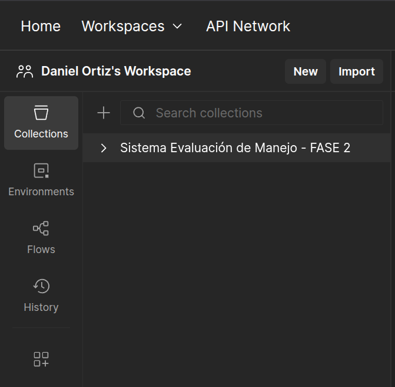

*Paso 1: Importar el archivo `postman/Evaluacion_Manejo.postman_collection.json` en Postman*

---

### 🔹 Ejemplo 1: Crear GENERO_CATALOGO

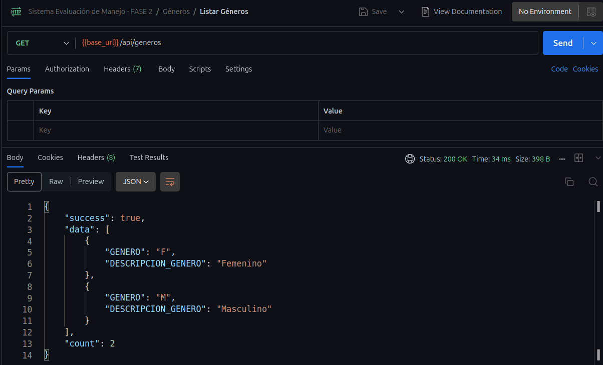

*Listar los géneros mediante POST request*

**Response:**

```json
{
    "success": true,
    "data": [
        {
            "GENERO": "F",
            "DESCRIPCION_GENERO": "Femenino"
        },
        {
            "GENERO": "M",
            "DESCRIPCION_GENERO": "Masculino"
        }
    ],
    "count": 2
}
```

---

### 🔹 Ejemplo 2: Crear DEPARTAMENTO

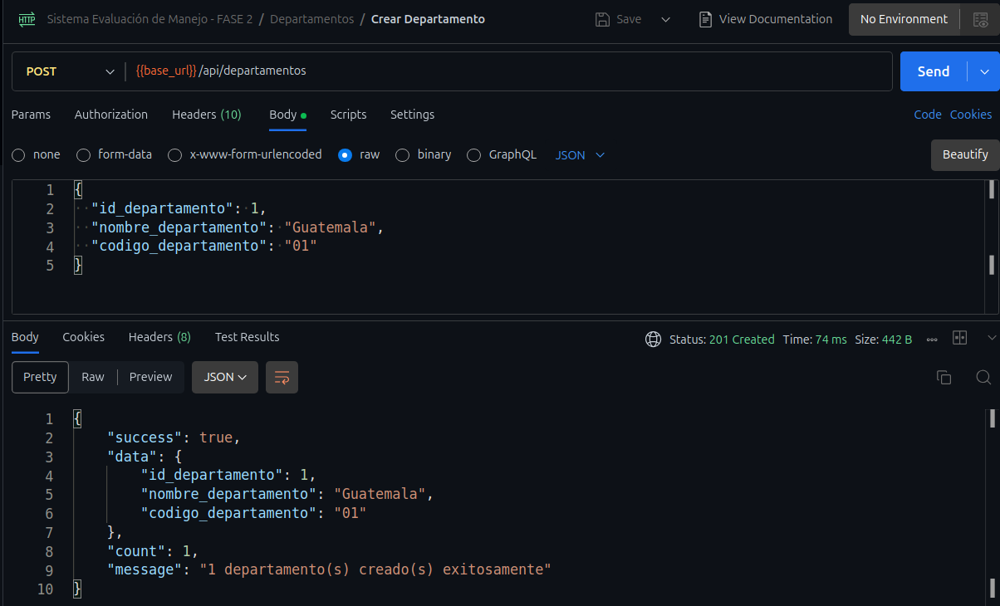

*Inserción de departamento Guatemala*

**Request:**

```json
POST http://localhost:3000/api/departamento
{
  "id_departamento": 1,
  "nombre_departamento": "Guatemala",
  "codigo_departamento": "01"
}
```

**Response:**

```json
{
    "success": true,
    "data": {
        "id_departamento": 1,
        "nombre_departamento": "Guatemala",
        "codigo_departamento": "01"
    },
    "count": 1,
    "message": "1 departamento(s) creado(s) exitosamente"
}
```

---

### 🔹 Ejemplo 3: Listar Departamentos (GET)

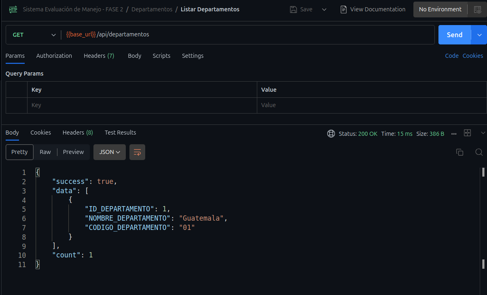

*Consulta de todos los departamentos registrados*

**Request:**

```
GET http://localhost:3000/api/departamento
```

**Response:**

```json
{
  "success": true,
  "data": [
    {
      "ID_DEPARTAMENTO": 1,
      "NOMBRE": "Guatemala"
    },
    {
      "ID_DEPARTAMENTO": 2,
      "NOMBRE": "Quetzaltenango"
    },
    {
      "ID_DEPARTAMENTO": 3,
      "NOMBRE": "Sacatepéquez"
    }
  ]
}
```

---

### 🔹 Ejemplo 4: Crear MUNICIPIO con Foreign Key

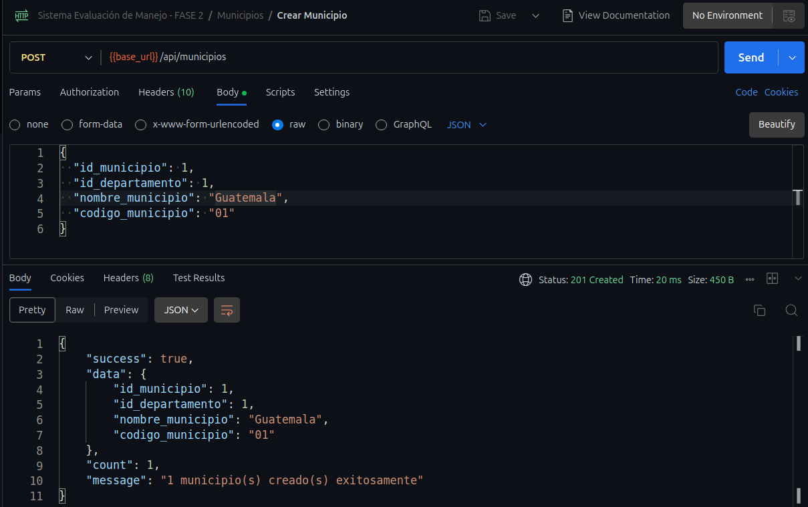

*Inserción de municipio con ID_DEPARTAMENTO (Foreign Key)*

**Request:**

```json
POST http://localhost:3000/api/municipio
{
  "NOMBRE": "Mixco",
  "ID_DEPARTAMENTO": 1
}
```

**Response:**

```json
{
  "success": true,
  "message": "Registro creado exitosamente",
  "data": {
    "ID_MUNICIPIO": 2,
    "NOMBRE": "Mixco",
    "ID_DEPARTAMENTO": 1
  }
}
```

---

### 🔹 Ejemplo 5: Error de Foreign Key Violada

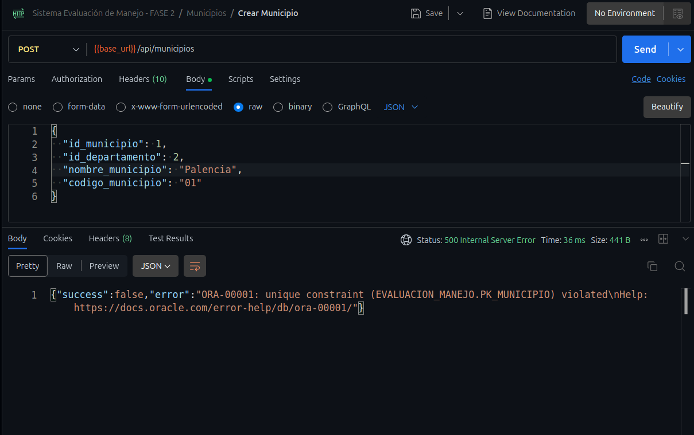

*Error al intentar crear MUNICIPIO sin DEPARTAMENTO existente*

**Request (Incorrecto):**

```json
POST http://localhost:3000/api/municipio
{
  "NOMBRE": "Municipio Test",
  "ID_DEPARTAMENTO": 999
}
```

**Response (Error):**

```json
{
  "success": false,
  "message": "Error al crear registro",
  "error": "ORA-02291: integrity constraint (EVALUACION_MANEJO.FK_MUNICIPIO_DEPTO) violated - parent key not found"
}
```

**Solución:** Crear primero el DEPARTAMENTO con ID 999, o usar un ID_DEPARTAMENTO existente.

---

### 🔹 Ejemplo 6: Crear PREGUNTA con Múltiples Campos

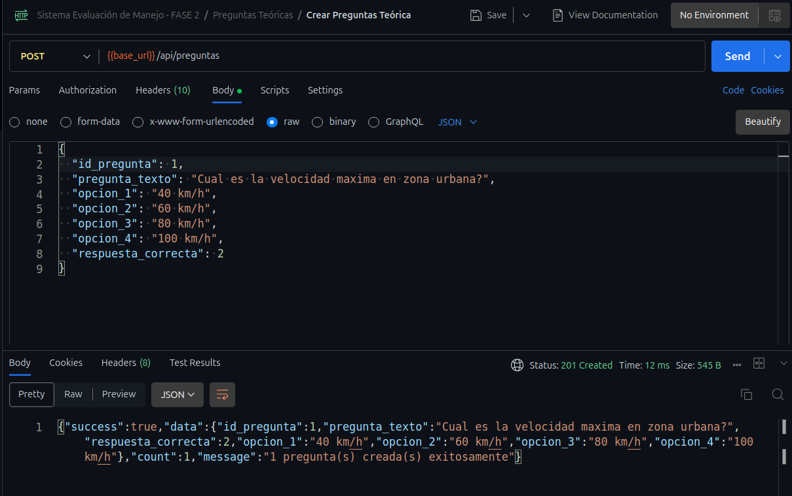

*Inserción de pregunta para examen teórico*

**Request:**

```json
POST http://localhost:3000/api/pregunta
{
  "ID_TIPO_LICENCIA": 2,
  "PREGUNTA": "¿Cuál es la velocidad máxima en zona urbana?",
  "OPCION_A": "40 km/h",
  "OPCION_B": "60 km/h",
  "OPCION_C": "80 km/h",
  "OPCION_D": "100 km/h",
  "RESPUESTA_CORRECTA": "B"
}
```

---

### 🔹 Ejemplo 7: Crear REGISTRO (Tabla Compleja)

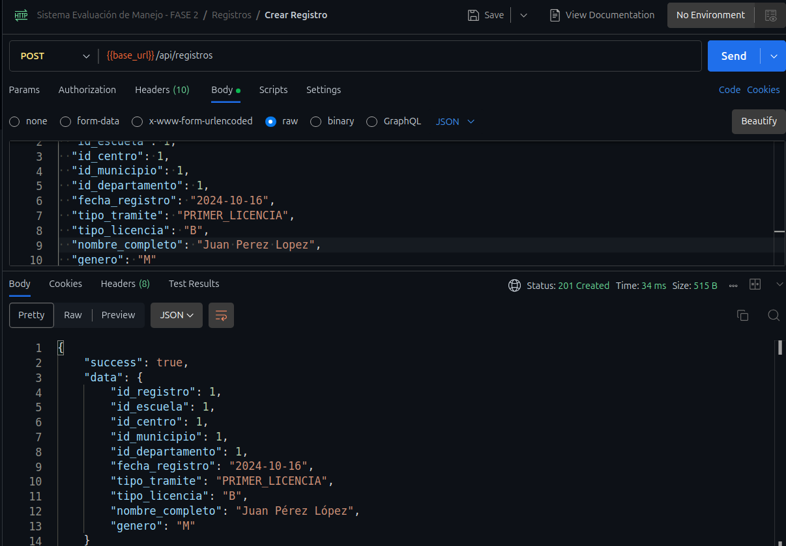

*Inserción de registro de usuario con múltiples Foreign Keys*

**Request:**

```json
POST http://localhost:3000/api/registro
{
  "NOMBRE": "Juan Carlos",
  "APELLIDO": "López García",
  "FECHA_NACIMIENTO": "1995-05-15",
  "NUMERO_IDENTIFICACION": "2345678901234",
  "CORREO_ELECTRONICO": "juan.lopez@email.com",
  "NUMERO_TELEFONO": "12345678",
  "DIRECCION_RESIDENCIA": "5ta Avenida 10-20, Zona 1",
  "ID_MUNICIPIO": 1,
  "FECHA_REGISTRO": "2025-01-15",
  "ID_ESCUELA": 1,
  "ID_TIPO_TRAMITE": 1,
  "ID_TIPO_LICENCIA": 2,
  "GENERO": "M"
}
```

---

### 🔹 Ejemplo 8: Verificación en DBeaver

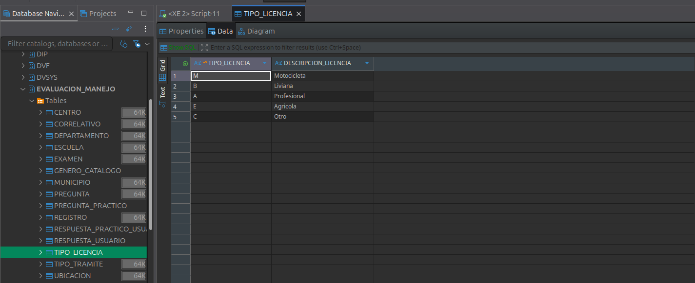

*Visualización de datos insertados en DBeaver*

**Consulta SQL:**

```sql
SELECT * FROM EVALUACION_MANEJO.DEPARTAMENTO;
SELECT * FROM EVALUACION_MANEJO.MUNICIPIO;
```

---

### 🔹 Ejemplo 9: Health Check de la API

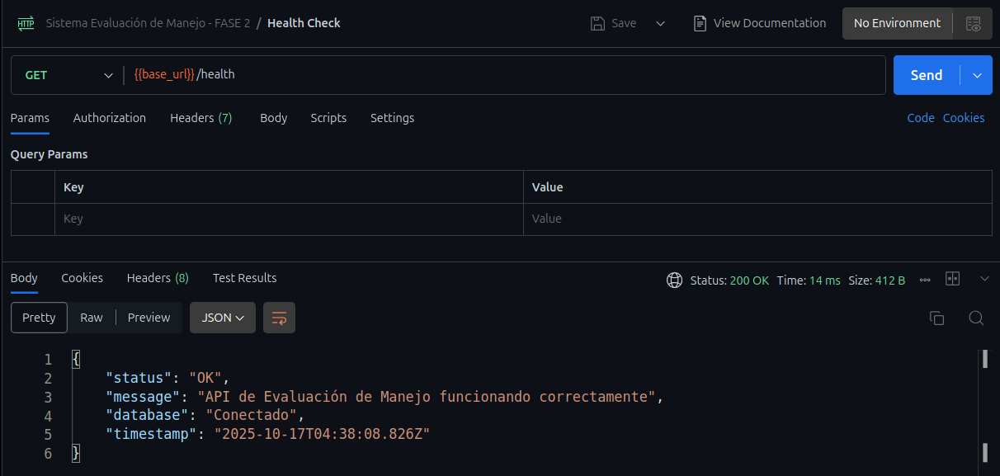

*Verificación de que la API está funcionando correctamente*

**Request:**

```
GET http://localhost:3000/health
```

**Response:**

```json
{
  "status": "OK",
  "message": "API de Evaluación de Manejo funcionando correctamente",
  "database": "Conectado",
  "timestamp": "2025-10-17T03:00:00.000Z"
}
```

---

### 🔹 Ejemplo 10: Colección Completa en Postman

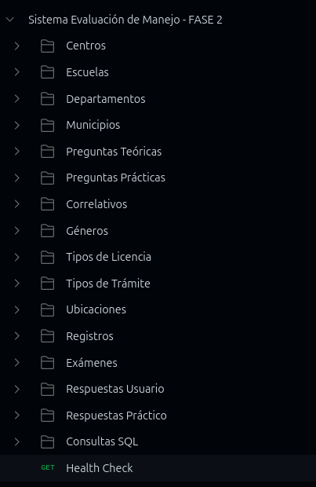

*Vista de la colección completa con 78 endpoints organizados por carpetas*

**Estructura:**

- 📁 GENERO_CATALOGO (4 endpoints)
- 📁 TIPO_LICENCIA (5 endpoints)
- 📁 TIPO_TRAMITE (5 endpoints)
- 📁 DEPARTAMENTO (5 endpoints)
- 📁 MUNICIPIO (5 endpoints)
- 📁 ESCUELA (5 endpoints)
- 📁 ... (15 carpetas en total)

---

### 📝 Notas sobre los Screenshots

> **💡 Recomendación:** Los screenshots sirven como guía visual. Asegúrate de:
>
> - ✅ Usar tus propios datos reales
> - ✅ Verificar que los IDs correspondan a tu base de datos
> - ✅ Seguir el orden de dependencias documentado
> - ✅ Verificar las respuestas después de cada inserción

---

<div align="center">

## � Respuestas del API

Todos los endpoints ahora retornan información del contador:

```json
{
  "success": true,
  "data": [...],
  "count": 3,
  "message": "3 departamento(s) creado(s) exitosamente"
}
```

**Ventajas de inserción múltiple:**

- ⚡ Más rápido (una sola petición HTTP)
- 🎯 Menos propenso a errores
- 📦 Carga masiva eficiente

---

## �📚 Documentación Relacionada

| Documento                             | Descripción                            |
| ------------------------------------- | --------------------------------------- |
| [GUIA_ENDPOINTS.md](./GUIA_ENDPOINTS.md) | Referencia completa de los 78 endpoints |
| [GUIA_TESTING.md](./GUIA_TESTING.md)     | Cómo probar la API con Postman         |
| [ARQUITECTURA.md](./ARQUITECTURA.md)     | Arquitectura del sistema                |
| [README.md](../README.md)                | Documentación principal                |

---

### 🎓 Universidad de San Carlos de Guatemala

**Facultad de Ingeniería**
**Escuela de Ciencias y Sistemas**
**Bases de Datos 1 - Sección B**

---

**Desarrollado por:** Héctor Daniel Ortiz Osorio
**Carnet:** 202203806
**Repositorio:** [github.com/DaaNiieeL123/BD1B_2S2025_202203806](https://github.com/DaaNiieeL123/BD1B_2S2025_202203806)

[](https://github.com/DaaNiieeL123/BD1B_2S2025_202203806)

---

**¡Gracias por usar esta guía!** 🚀

Si encuentras algún error o tienes sugerencias, no dudes en crear un issue en GitHub.

</div>
